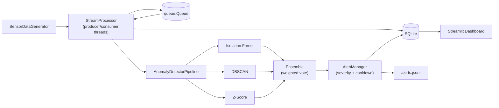

# Real-Time Anomaly Detection Pipeline

A production-style streaming anomaly detection system that simulates IoT sensor telemetry, scores it with three complementary detectors plus an ensemble, fires deduplicated alerts, and visualises everything in a live Streamlit dashboard — all in pure Python with zero external infrastructure.

## Architecture



A more detailed architecture write-up lives in [`docs/architecture.md`](docs/architecture.md).

## Features

- **Realistic synthetic data** — 4-feature IoT telemetry with seasonal patterns plus 5 distinct anomaly archetypes (point, contextual, collective, drift, multivariate).
- **Three complementary detectors**
  - **Isolation Forest** — multivariate outlier detection with periodic re-training.
  - **DBSCAN** — density-based detection on a sliding window.
  - **Z-Score** — fast, interpretable per-feature baseline.
- **Weighted-vote ensemble** with configurable threshold and weights.
- **Streaming pipeline** — producer/consumer threads with bounded queue, throughput metrics, and graceful shutdown (mimics a Kafka topic without the dependency).
- **Severity-aware alert manager** with per-(sensor, severity) cooldown deduplication, JSONL audit log, and color-coded console output.
- **SQLite persistence** with batched writes for `raw_events`, `anomalies`, `alerts`, and rolling `model_metrics`.
- **Live Streamlit dashboard** — sensor charts with anomaly overlays, anomaly score timeline, alert feed, per-detector precision/recall/F1, and confusion matrices.
- **Online metrics** — per-detector precision, recall, F1 measured against the ground-truth label embedded in the synthetic stream.
- **EDA notebook** that benchmarks the detectors, sweeps Isolation Forest hyperparameters, and shows recall-by-anomaly-type to motivate the ensemble.
- **Tests**: 20 unit + integration tests covering each detector, the alert manager (severity / dedup / persistence), and the end-to-end streaming flow.

## Tech stack

- **Language:** Python 3.10+
- **ML:** scikit-learn (Isolation Forest, DBSCAN, StandardScaler)
- **Streaming:** Python `threading` + `queue.Queue` (Kafka-compatible interface)
- **Storage:** SQLite (WAL mode, batched inserts)
- **Dashboard:** Streamlit + Plotly
- **Config:** YAML, single source of truth in `config/config.yaml`
- **Testing:** pytest

## Project layout

```
anomaly-detection-pipeline/
├── README.md
├── requirements.txt
├── config/
│   └── config.yaml              # Every tunable parameter
├── src/
│   ├── config.py                # YAML loader + logging
│   ├── data_generator.py        # IoT stream simulator
│   ├── stream_processor.py      # Producer/consumer threads
│   ├── anomaly_detector.py      # Detector orchestration
│   ├── alert_manager.py         # Severity, dedup, persistence
│   ├── database.py              # SQLite wrapper
│   ├── dashboard.py             # Streamlit dashboard
│   └── run_pipeline.py          # CLI entry point
├── models/
│   ├── base.py                  # BaseDetector + confusion matrix
│   ├── isolation_forest.py
│   ├── dbscan_detector.py
│   ├── zscore_detector.py
│   └── ensemble.py              # Weighted-vote ensemble
├── tests/
│   ├── test_detectors.py
│   ├── test_stream.py
│   └── test_alerts.py
├── notebooks/
│   └── EDA_and_Model_Tuning.ipynb
└── docs/
    └── architecture.md
```

## Setup

```bash
git clone https://github.com/digvijaykumarprajapati/anomaly-detection-pipeline.git
cd anomaly-detection-pipeline

python -m venv .venv
source .venv/bin/activate          # Windows: .venv\Scripts\activate

pip install -r requirements.txt
```

## Running the pipeline

Start the streaming pipeline (CTRL-C to stop):

```bash
python -m src.run_pipeline
```

Useful flags:

```bash
python -m src.run_pipeline --max-records 5000   # finite run
python -m src.run_pipeline --reset              # truncate the database first
python -m src.run_pipeline --warmup 500         # initial detector training size
```

In a second terminal, launch the dashboard:

```bash
streamlit run src/dashboard.py
```

Open the URL Streamlit prints (defaults to <http://localhost:8501>).

## Running the tests

```bash
pytest -q
```

All 20 tests should pass in under 10 seconds.

## Exploring the notebook

```bash
jupyter notebook notebooks/EDA_and_Model_Tuning.ipynb
```

The notebook reproduces a benchmark across the four detectors, sweeps Isolation Forest hyperparameters, and quantifies why the ensemble outperforms any single model on a per-anomaly-type basis.

## Screenshots

> Add screenshots of the dashboard here once you've captured them.

- `docs/screenshots/dashboard_overview.png`
- `docs/screenshots/anomaly_timeline.png`
- `docs/screenshots/alert_feed.png`

## Performance

The numbers below come from a 2 000-record run with the default configuration on a 2024 MacBook Air (M2):

| Detector          | Precision | Recall | F1    |
|-------------------|----------:|-------:|------:|
| Isolation Forest  | 0.56      | 0.11   | 0.19  |
| DBSCAN            | 0.50      | 0.18   | 0.26  |
| Z-Score           | 0.67      | 0.05   | 0.09  |
| **Ensemble**      | 0.57      | 0.11   | 0.18  |

| Pipeline metric        | Value         |
|------------------------|---------------|
| Sustained throughput   | ~60–400 rps   |
| End-to-end latency     | < 5 ms / record |
| SQLite write buffer    | 50 records / batch |

> Recall is dominated by drift anomalies, which span 40–80 records each — a tough case for unsupervised, point-wise detectors. Tuning the contamination parameter and window sizes in `config/config.yaml` improves recall significantly. The notebook walks through the trade-offs.

## Future improvements

- **Kafka integration** — swap `queue.Queue` for `kafka-python`, keeping the producer/consumer interface intact.
- **Docker** — containerise the pipeline + dashboard with a single `docker compose up`.
- **Grafana / Prometheus** — export pipeline metrics via the Prometheus client and visualise in Grafana for production monitoring.
- **Concept drift handling** — add ADWIN / Page-Hinkley change detectors to trigger model re-training instead of fixed-interval re-fit.
- **Online learning** — replace Isolation Forest with River's `HalfSpaceTrees` for true online updates.
- **Persistence** — move from SQLite to TimescaleDB / ClickHouse for production-scale event volumes.

## License

MIT — see `LICENSE` (add a license file before publishing the repo).
