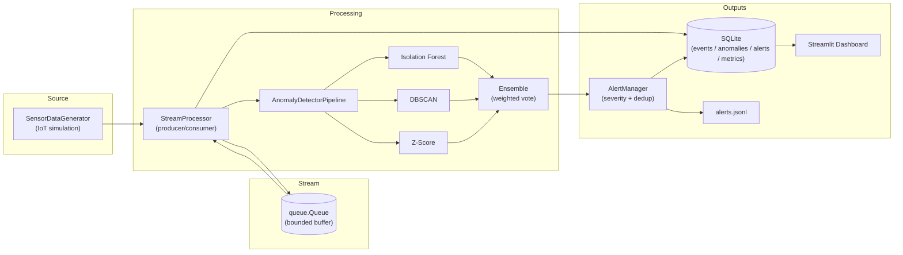

# System Architecture

## Overview

The pipeline is a single-process Python application that simulates a real-time
streaming workload. A producer thread emits synthetic IoT records onto an
in-memory queue; a consumer thread drains the queue, scores each record with
four anomaly detectors, persists results to SQLite, and feeds the alert
manager.

## Diagram

## Component responsibilities

| Component | Responsibility |
|-----------|----------------|
| `SensorDataGenerator` | Emits realistic IoT records with seasonal patterns and 5 injected anomaly types. Yields a Python generator. |
| `StreamProcessor` | Owns the producer/consumer threads, throughput metrics, and the sliding context window. |
| `AnomalyDetectorPipeline` | Holds the four detectors and routes each record through them; tracks per-detector confusion counts. |
| `IsolationForestDetector` | Tree-based detector with periodic re-fitting on a sliding training window. |
| `DBSCANDetector` | Density-based clustering on the live window — noise points are anomalies. |
| `ZScoreDetector` | Per-feature rolling mean / std; flags any record beyond Nσ on any feature. |
| `EnsembleDetector` | Weighted-vote combination of the three base detectors. |
| `AlertManager` | Severity classification (LOW/MEDIUM/HIGH), deduplication via cooldown window, JSONL audit log, console color output. |
| `Database` | Thread-safe SQLite wrapper with batched inserts and dashboard query helpers. |
| `Dashboard` | Streamlit app that reads from SQLite and refreshes every 2 s. |

## Threading model

The pipeline runs three daemon threads inside the main process:

1. **Producer** — pulls records from `SensorDataGenerator.stream()` and
   `put`s them on the queue. Blocks if the queue is full.
2. **Consumer** — `get`s records from the queue, runs them through the
   detector pipeline, persists results, and triggers alerts.
3. **Metrics** — periodically (every `metrics_interval_seconds`) snapshots
   throughput and persists per-detector precision/recall/F1 to the
   `model_metrics` table.

A sentinel object on the queue and a `threading.Event` provide a clean
shutdown path: `StreamProcessor.stop()` sets the event, drops the sentinel,
joins each thread, and flushes the database.

## Data flow

1. Generator yields `record = {timestamp, sensor_id, temperature, ...}`.
2. Consumer pushes the record into the SQLite write buffer.
3. Detector pipeline scores the record with each member detector and the
   ensemble. Per-detector confusion counts are updated against the ground
   truth label embedded in the record.
4. Each detector hit (one row per detector) is buffered for SQLite.
5. Alert manager evaluates the combined results, classifies severity, and
   either fires a new alert or suppresses it via the cooldown window.
6. Periodically the metrics thread snapshots the confusion-matrix counts
   and the buffered writes are flushed to disk.

## Configuration

Every tunable parameter is centralised in `config/config.yaml` and read once
at startup by `src/config.py`. The dashboard, the run script, and the tests
all read from the same loader.

## Why no Kafka?

The point of the project is to demonstrate the streaming *pattern* — bounded
queues, back-pressure, windowing, online detection — without forcing the
reader to install Kafka. The interface between the producer thread and
`queue.Queue` is intentionally close to a Kafka producer/consumer so that
swapping in `kafka-python` would only touch `stream_processor.py`.
